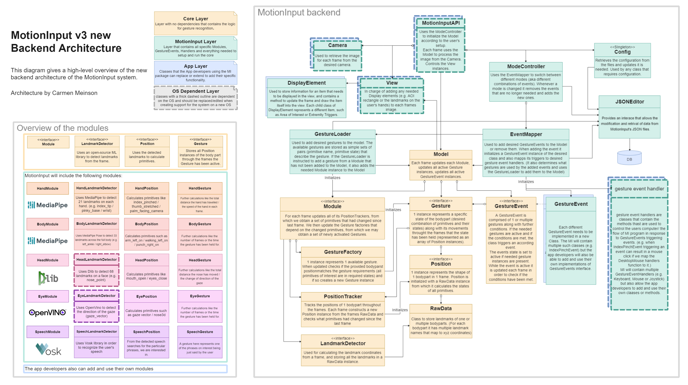

# Setting Up
- Expected to be run on Python 3.9 + Windows
- Make sure you have installed all the libraries in the requirements.txt
- As we don’t yet have the GUI, App layer and the app-specific main.py, we are using the [motioninput_api.py](https://motioninput.github.io/getting-started.html#running-the-code) to run the system.

# Architecture

So a quick overview of how the system works. It can be observed in 2 parts: the setup and the frame by frame processing.

## setup
- Firstly, information for gestures and events are loaded from the JSON files
- The ModeController class is used to decide which events should be added to the model. (set of events based on the default mode in the mode_controller.json)
- The EventMapper then initialises the according event classes (mapping them to desired handlers) and add them to the model. (events as defined in events.json)
- Based on the added events the needed gestures and modules are automatically added to the model by the GestureLoader. (gestures as defined in gestures.json)

## frame by frame
- The opencv image is retrieved from the camera class.
- Process the frame in the Model in following steps:
    - Update the modules:
        - Use the module's landmark detector (ML library) to retrieve the RawData (aka the coordinates of all landmarks) from the frame.
        - Update all position trackers with the RawData, which results in a set of primitives that had changed since the last frame.
        - Update all the gesture factories that use the changed primitives, which may create new active Gestures.
    - If the module created any Gesture instances, they are added to the model, which may lead to (de)activation of some gesture events.
    - Update all the active gestures, which may result in deactivation of some of them, and consequently (de)activation of some gesture events.
    - Run all active gesture events, which may result in the trigger functions in the events being called.

# Running the code
The system can be run without the GUI by running the motioninput_api.py and the behaviour of the system can be adjusted by changing the [JSON files](https://motioninput.github.io/configuration.html)

Alternatively to open the protocol connection you can run motioninput.py in which case you can interact with the code through the stdin using the [protocol](https://motioninput.github.io/development.html#backend-frontend-communication-protocol).

Note: Currently, for the extremity triggers in the body module, hardcoded calibration information is located in the various JSON files. In particular, the coordinates of the extremity triggers are set manually. Documentation of how developers can interact with the config JSONs can be found [here](https://motioninput.github.io/apidocs/scripts.tools.html#json_editors)

# Adding Features
## Adding GestureEvents
Create a new class extending the [GestureEvent](https://motioninput.github.io/apidocs/scripts.gesture_events.html) class from the [core](https://motioninput.github.io/apidocs/scripts.core.html#) module (many examples are available in the gesture_events folder).
You can check the currently available gestures in the [data/gestures.json](https://motioninput.github.io/configuration.html#gestures) and in case the gestures you need are not available feel free to add a new [Gesture](https://motioninput.github.io/getting-started.html#adding-gestures)
(Just a note that you are allowed to use gestures from different modules in the same event).
Once you have added the event class into the gesture_events folder, you need to add it to the folders \_\_init\_\_.py file in the same way the previous events were added, in order for the EventMapper to have access to it. Now if you want to actually add the event into your Model and use it first you need to add it into the [data/events.json](https://motioninput.github.io/configuration.html#events) as the other events have been added (this is where you map the events triggers to actual functions from the gesture event handlers and if the handlers you require are not available to you feel free to [add a new event handler](https://motioninput.github.io/getting-started.html#adding-event-handlers)).
Now you are all set and should be able to use the gesture event after adding it to a mode in the [data/mode_controller.json](https://motioninput.github.io/configuration.html#modes)

NB! Please also add any new events to the "Currently available Events" section of this doc along with a short description of it.

## Adding Gestures
Adding new [Gestures](https://motioninput.github.io/apidocs/scripts.core.html#scripts.core.gesture.Gesture) is as easy as adding one line to the [data/gestures.json](https://motioninput.github.io/configuration.html#gestures) file, with just the name of the gesture and a set of all the primitives it uses (again plenty of examples already available). Note that the name of the gesture should not overlap with the name of any other gesture, even in other modules.
In case the primitives you need are not available feel free to add a new [primitive](https://motioninput.github.io/getting-started.html#adding-primitives).

## Adding Primitives
Now adding primitives is a bit trickier and definitely should not be done too often, as unlike Gestures and GestureEvents the primitives affect the efficiency of processing each frame, as for every frame we calculate the states of all the primitives.
Adding primitives is done in the specific modules [Position](https://motioninput.github.io/apidocs/scripts.core.html#scripts.core.position.Position) classes (so currently in the HandPosition, BodyPosition and ExercisePosition classes)

## Adding event handlers
Event handlers (classes that contain all the functions that are called by GestureEvents and are responsible for actually controlling the users computer e.g. moving the mouse or pressing keys) are stored in the gesture_event_handlers folder. If you have added any new classes or new functions to already existing handler classes, please first add them to the \_\_init\_\_.py file in the gesture_event_handlers folder in the same manner as the previous examples, in order for the EventMapper class to be able to use the new functionality. After this you can now use your handler by mapping GestureEvents to it in the EventMapper class.
